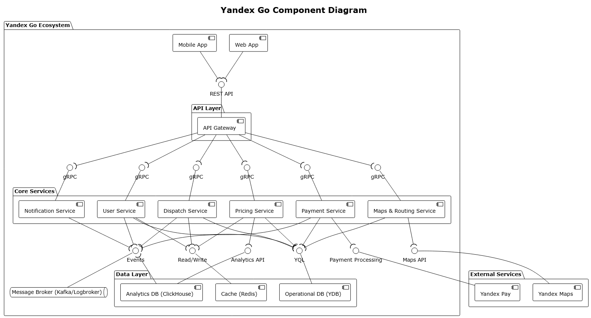
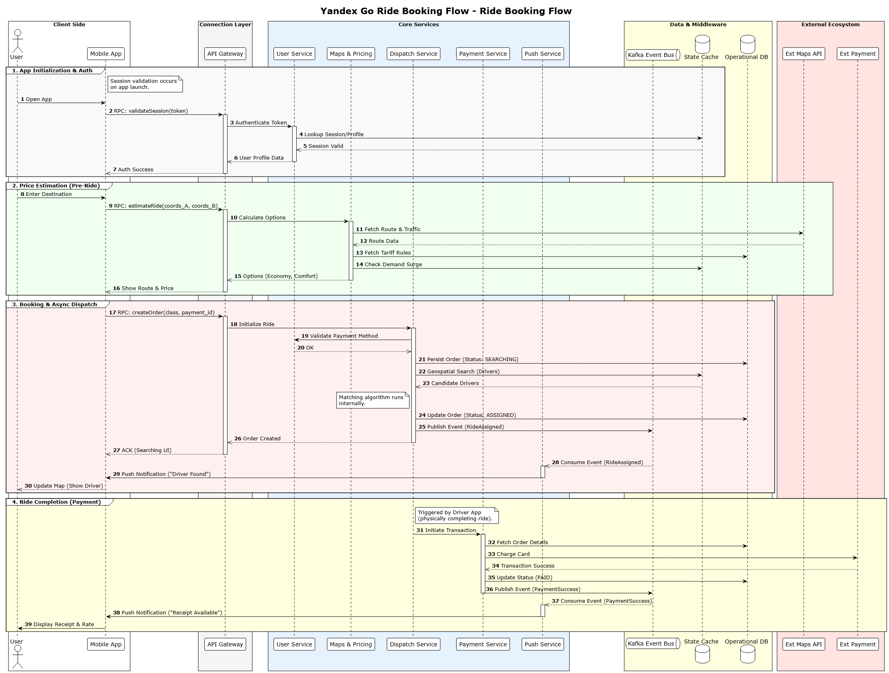

# Yandex Go

go.yandex

Yandex go is the service for ordering a taxi.

## Components

## 1 notification sevice

A notification service is a software system, component, or API that manages, sends, and tracks messages—such as push notifications, emails, or SMS—to users across various platforms.

## 2 dispatch service

A dispatch service is a professional logistics and coordination function that manages the scheduling, routing, and real-time tracking of vehicles, technicians, or personnel to ensure timely delivery or service completion.

## 3 pricing service

A pricing service is a software-based solution or systematic method used by businesses to accurately calculate, manage, and automate the pricing of products or services based on rules, market data, and customer data.

## 4 payment service

A payment service provider (PSP) is a third-party company that enables businesses to accept various electronic payment methods—such as credit cards, debit cards, and digital wallets—by acting as an intermediary between merchants, customers, and financial institutions.

## 5 maps & routing service

A maps & routing service is a digital tool that calculates and displays the most efficient paths between locations, providing turn-by-turn directions, travel times, and distance estimations.

# Data flow

I picked first group "App initialization and Auth" that block manages the process of interaction between user and app when user enter his profile.

## Step by step working process

## User opens app

components: user -> app

data: app starts
